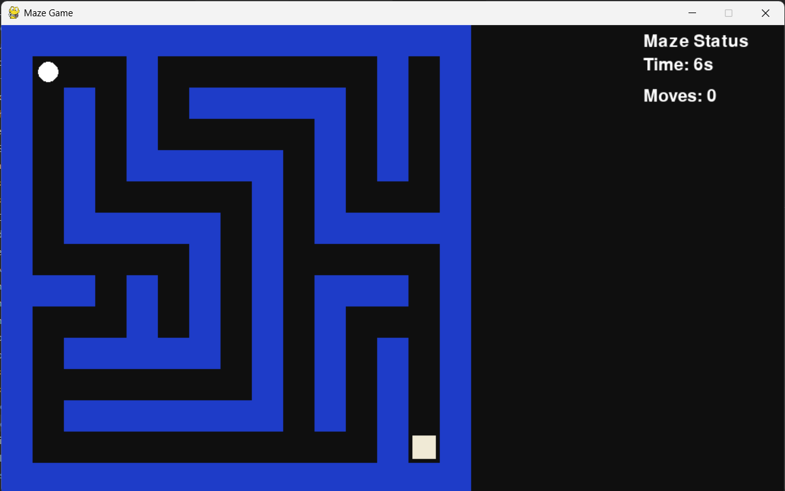
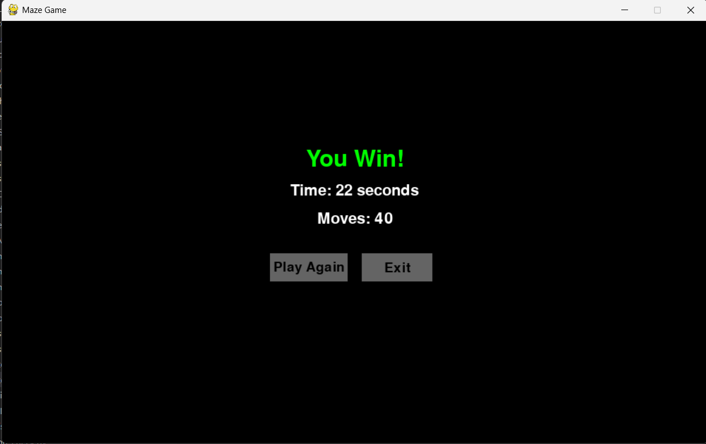
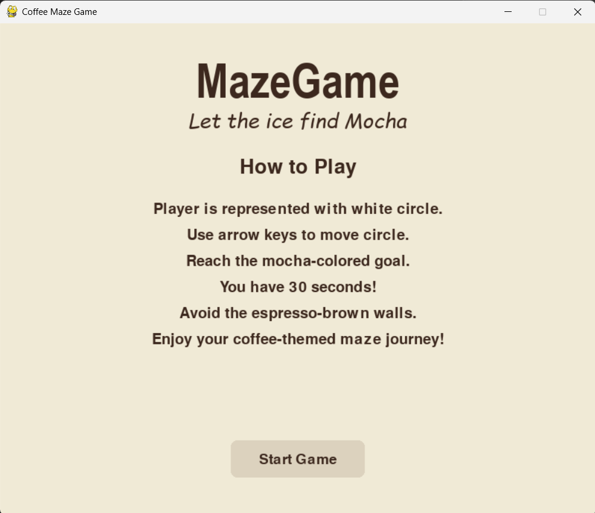
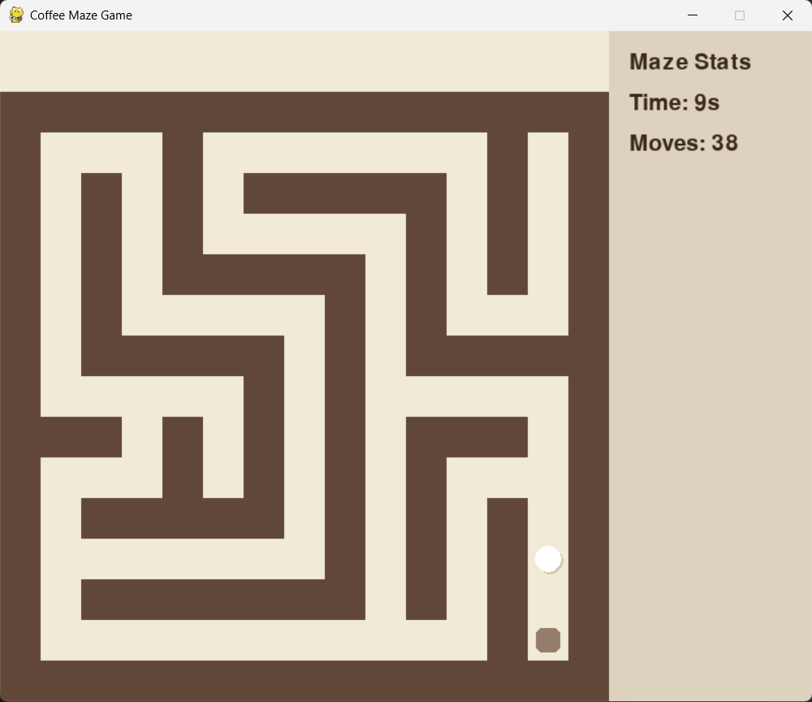
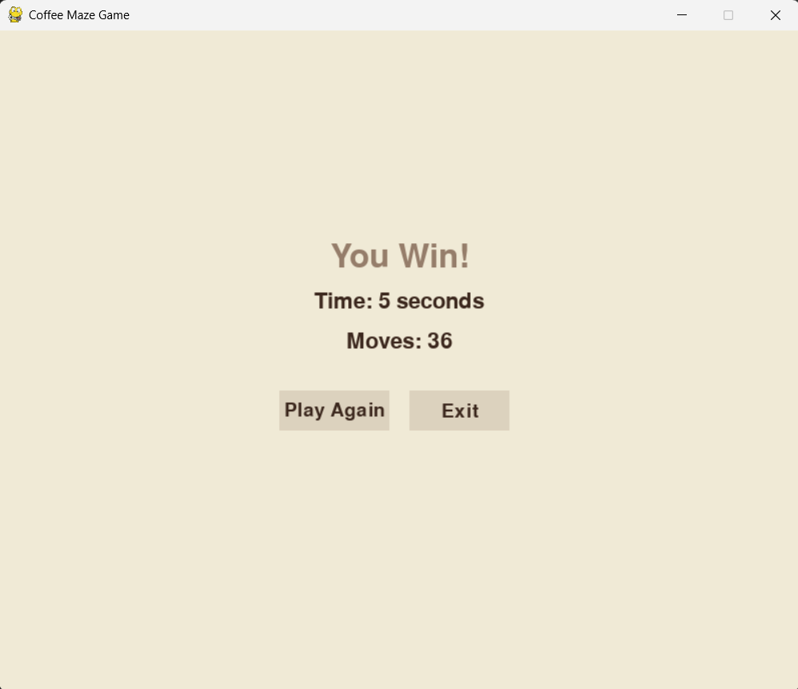
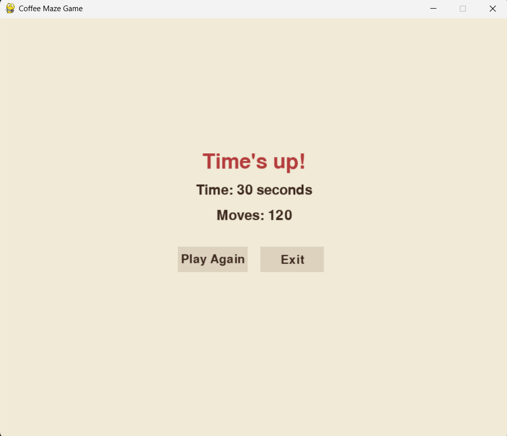
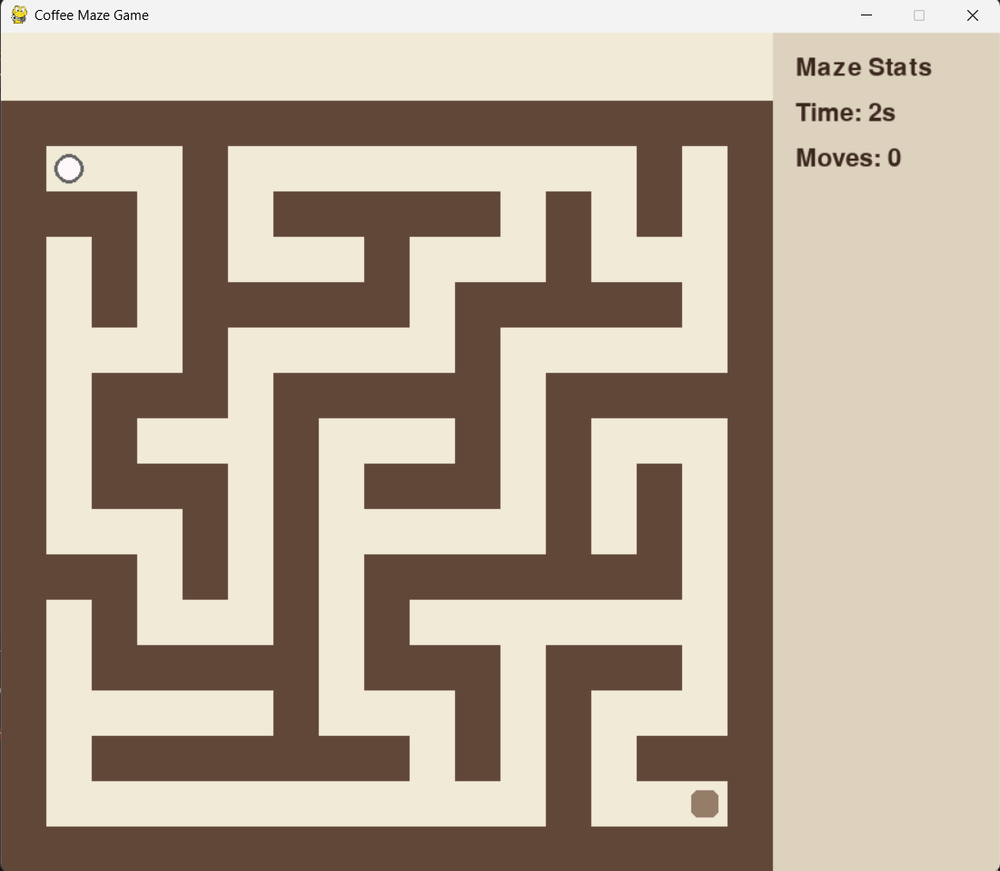
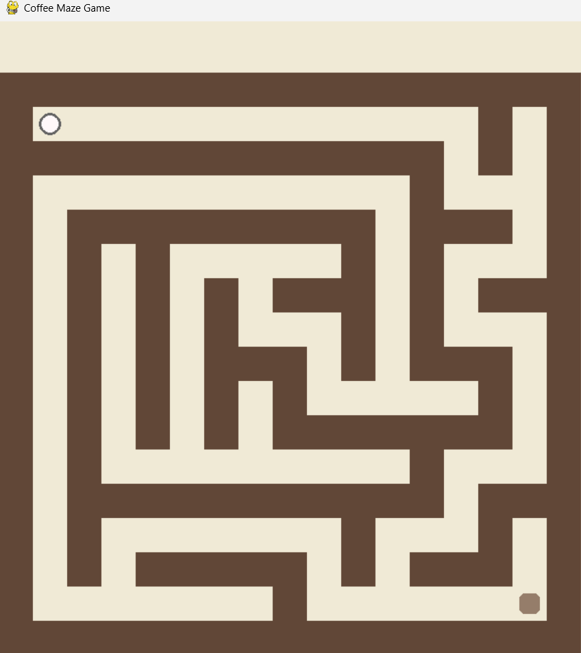

# PyGameMaze


#### _About game._
This repository contains different versions of a maze game built using **Pygame (Python)**.

Each version implements the same core idea (navigate through a maze), but with different structure, visuals, and features.

- A maze is displayed on screen
- You control a player (circle) using **arrow keys**
- You cannot pass through walls (`W` in the grid)
- The goal is to reach the target tile
- You have a **30 second time limit**
- The game tracks:
  - Time taken
  - Number of moves


### _Structure:_
```
pyGameMaze/
│
├── blue_theme/
│   └── main.py
│
├── coffee_theme/
│   └── main.py
│
└── assets/
    ├── blue_theme.png
    └── coffee_theme.png
```

### _Technologies_
Python | Pygame

### _How to run this repository_
```bash
git clone https://github.com/KapX09/pyGameMaze.git
cd pyGameMaze
pip install pygame
cd [select your theme]_theme
python main.py
```

## Blue Theme (Basic Version)
This version uses a **fixed maze layout** (hardcoded grid).

### What happens when you run it:
- Game starts directly (no intro screen)
- A maze appears with: Dark background, Blue walls, White circular player
- Goal is shown as a light-colored square
- Right side shows: Time, Move count

### Gameplay flow:
- Move using arrow keys. Each valid move increases move count
- If you _reach the goal_ →  **"You Win!" screen appears** with stats OR If _30 seconds pass_ → **"Time’s up!" screen appears**

### End screen:
- Shows: Time taken | Moves | Buttons: `Play Again`, `Exit`

### Output:
_Creating the basic model of Maze in Blue themed presentation. Here are some preview of the game._




---

## Coffee Theme
This version changes both **visuals and structure**, and also adds new features.

### Key differences from Blue Theme:
- Maze is **generated randomly** using recursive backtracking | UI layout is adjusted (maze centered + sidebar + title space)
- Includes an **instruction screen before gameplay** | Uses a full **coffee-inspired color palette**

#### Screen Display
##### 1. Instruction Screen
- Title: *MazeGame*
- Subtitle: *"Let the ice find Mocha"*
- Displays: Controls | Goal | Time limit | Button: `Start Game`

##### 2. Game Start
- A **new random maze** is generated every time | Maze is centered on screen | Sidebar shows: Time & Moves

#### Visual elements:
- Walls → espresso brown | Path → light cream | Player → light circle with border | Goal → mocha-colored rounded box |

#### Gameplay flow:
- Same controls (arrow keys) | Movement is restricted by walls | Move counter updates | Timer runs (30 seconds)

#### End conditions:
- Reach bottom-right goal →  **"You Win!" screen**
- Time runs out →  **"Time's up!" screen**
  
#### End screen:
- Same structure as blue version
- Styled with theme colors
- Options: `Play Again` | `Exit`


### Output:
_Creating the basic model of Maze in coffee themed presentation. Here are some preview of the game._













---
